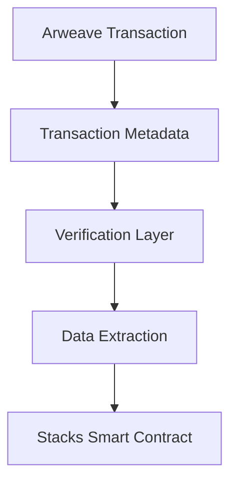

# Smart Arweave Parser

## Overview

Smart Arweave Parser is a Clarity smart contract designed to facilitate parsing and interaction with Arweave data transactions directly from the Stacks blockchain. This contract provides a robust, secure mechanism for verifying and extracting metadata from permanent, decentralized data storage.

### Key Features

- Decentralized Arweave transaction metadata parsing
- Secure transaction verification
- Flexible data extraction mechanisms
- Minimal gas consumption design

## Technical Architecture



### Core Components

- Transaction Metadata Parsing
- Cryptographic Verification
- Metadata Extraction Utilities
- Error Handling Mechanisms

## Getting Started

### Prerequisites

- Clarinet CLI
- Stacks Wallet
- Basic understanding of Arweave and decentralized storage

### Installation

1. Clone the repository
2. Install dependencies: `clarinet install`
3. Run tests: `clarinet test`

### Basic Usage

```clarity
;; Example function call
(contract-call? .arweave_parser parse-transaction 
    tx-hash 
    metadata-fields)
```

## Function Reference

### Public Functions

#### Transaction Parsing
```clarity
(parse-transaction 
    (tx-hash (buff 32)) 
    (metadata-fields (list 10 (string-ascii 50))))
```

## Security Considerations

- Cryptographic signature verification
- Minimal external dependencies
- Stateless design for gas efficiency

## Development Roadmap

- [ ] Complete core parsing mechanism
- [ ] Implement comprehensive test suite
- [ ] Add advanced metadata extraction
- [ ] Optimize gas consumption

## Contributing

1. Fork the repository
2. Create your feature branch
3. Commit your changes
4. Push to the branch
5. Create a Pull Request

## License

MIT License